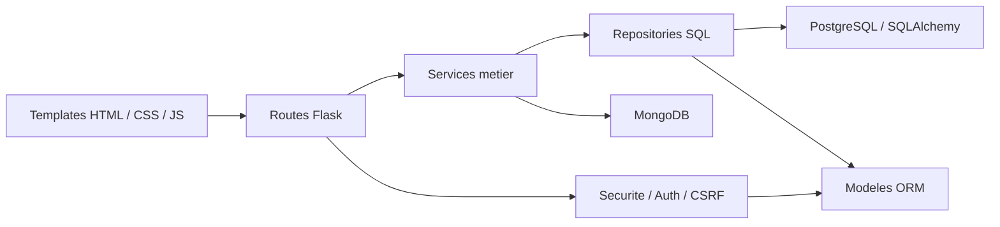

# Architecture multicouche - Staffly

## Objectif

Cette note formalise une architecture plus proche des attendus CDA.
Le projet n'est plus seulement organise par type de fichier front/back,
mais en couches applicatives clairement identifiables.

## Couches en place

### 1. Point d'entree

- `app.py`

Rôle :
- expose l'application Flask ;
- conserve un point d'entree simple pour Gunicorn, Railway et Flask CLI.

### 2. Factory et configuration

- `staffly/__init__.py`
- `staffly/config.py`

Rôle :
- creation de l'application ;
- chargement de l'environnement ;
- injection des configurations ;
- declaration des chemins `templates` et `static`.

### 3. Extensions techniques

- `staffly/extensions.py`

Rôle :
- centraliser les extensions Flask ;
- partager `db` et `bcrypt` dans toute l'application.

### 4. Couche modele

- `staffly/models.py`

Rôle :
- representer les entites metier persistantes ;
- decrire la structure relationnelle PostgreSQL ;
- definir les relations ORM.

Entites principales :
- `Manager`
- `Task`
- `Employee`
- `LeaveRequest`

### 5. Couche securite

- `staffly/security.py`

Rôle :
- gerer l'authentification de session ;
- proteger les routes ;
- controler les acces par proprietaire ;
- gerer la protection CSRF ;
- ajouter les headers HTTP de securite.

### 6. Couche repository

- `staffly/repositories.py`

Rôle :
- encapsuler les requetes d'acces SQL ;
- limiter les requetes directement ecrites dans les routes ;
- faciliter les tests et la lisibilite.

Exemples :
- lecture d'un manager par email ;
- liste des taches recentes ;
- liste des employes ;
- liste des demandes de conges.

### 7. Couche service

- `staffly/services.py`

Rôle :
- porter la logique metier reutilisable ;
- isoler la logique d'authentification ;
- isoler les traitements IA ;
- gerer la persistence NoSQL MongoDB ;
- porter le seeding demo.

Exemples :
- creation de compte manager ;
- authentification manager ;
- generation de suggestions IA ;
- sauvegarde d'un document MongoDB.

### 8. Couche presentation / routes

- `staffly/routes.py`

Rôle :
- recevoir les requetes HTTP ;
- valider les donnees de formulaire ;
- appeler les services et repositories ;
- renvoyer les templates HTML.

## Benefices pour le CDA

- meilleure separation des responsabilites ;
- architecture plus lisible pour le jury ;
- base plus propre pour faire evoluer le projet ;
- preuve d'une application organisee en couches ;
- reduction du couplage entre routes, acces aux donnees et logique metier.

## Schema simplifie

