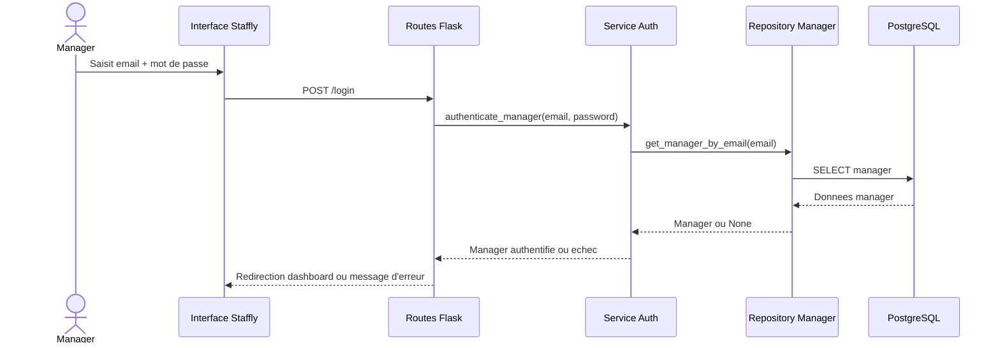
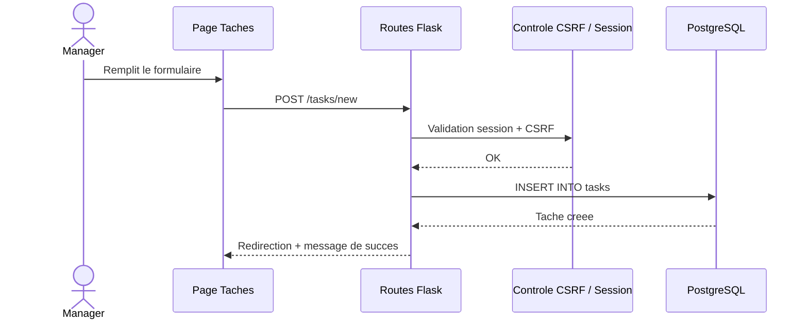

# Diagrammes de sequence - Staffly

## 1. Connexion manager

```mermaid
sequenceDiagram
    actor Manager
    participant UI as Interface Staffly
    participant Routes as Routes Flask
    participant Services as Service Auth
    participant Repo as Repository Manager
    participant DB as PostgreSQL

    Manager->>UI: Saisit email + mot de passe
    UI->>Routes: POST /login
    Routes->>Services: authenticate_manager(email, password)
    Services->>Repo: get_manager_by_email(email)
    Repo->>DB: SELECT manager
    DB-->>Repo: Donnees manager
    Repo-->>Services: Manager ou None
    Services-->>Routes: Manager authentifie ou echec
    Routes-->>UI: Redirection dashboard ou message d'erreur
```

## 2. Creation d'une tache

```mermaid
sequenceDiagram
    actor Manager
    participant UI as Page Taches
    participant Routes as Routes Flask
    participant Security as Controle CSRF / Session
    participant DB as PostgreSQL

    Manager->>UI: Remplit le formulaire
    UI->>Routes: POST /tasks/new
    Routes->>Security: Validation session + CSRF
    Security-->>Routes: OK
    Routes->>DB: INSERT INTO tasks
    DB-->>Routes: Tache creee
    Routes-->>UI: Redirection + message de succes
```
