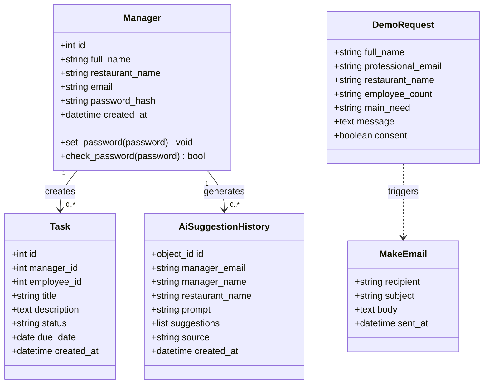
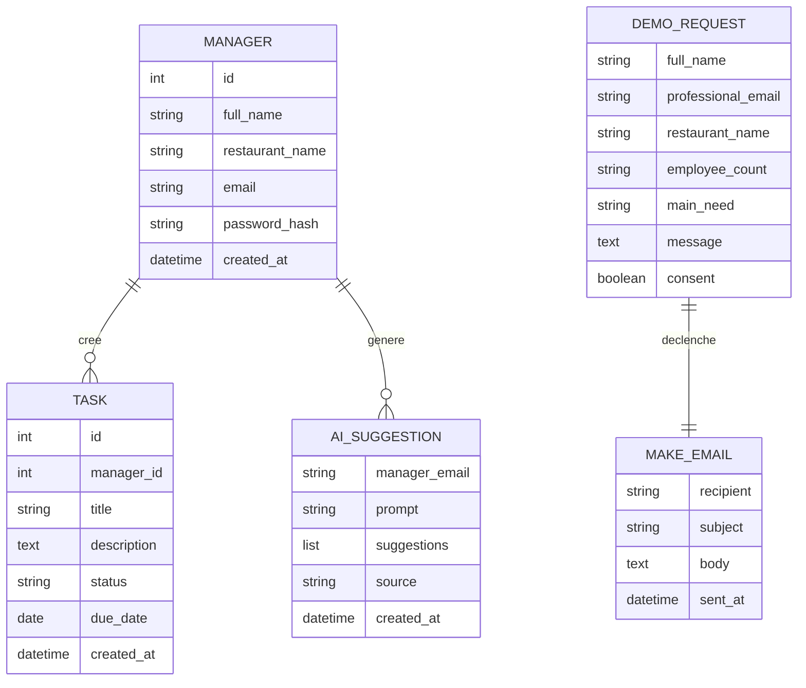

# Modelisation Bloc 2 - Staffly

## Perimetre retenu

Le MVP presente pour le Bloc 2 est volontairement simple afin de rester realiste sur un delai court :

- une landing page Staffly ;
- une inscription et une connexion manager ;
- un dashboard ;
- une gestion des taches ;
- une suggestion de taches avec IA ;
- un formulaire Tally pour demander une demo ;
- une automatisation Make qui envoie un email apres une demande.

PostgreSQL est utilise pour les donnees relationnelles de l'application.
MongoDB est utilise comme preuve NoSQL pour stocker l'historique technique des suggestions IA.

Note : les entites `Employee` et `LeaveRequest` existent encore dans le code comme base d'evolution, mais elles ne sont pas affichees dans le MVP final. Elles pourront etre reprises plus tard pour une version CDA plus complete.

## UML - Diagramme de classes



## MERISE - MCD



## MERISE - MLD / LMD

### Tables SQL principales

```txt
MANAGER(
  id PK,
  full_name,
  restaurant_name,
  email UNIQUE,
  password_hash,
  created_at
)

TASK(
  id PK,
  manager_id FK -> MANAGER.id,
  title,
  description,
  status,
  due_date,
  created_at
)
```

### Collection NoSQL

```txt
AI_SUGGESTION_HISTORY(
  _id,
  manager_email,
  manager_name,
  restaurant_name,
  prompt,
  suggestions[],
  source,
  created_at
)
```

### Donnees externes Tally / Make

```txt
DEMO_REQUEST(
  full_name,
  professional_email,
  restaurant_name,
  employee_count,
  main_need,
  message,
  consent
)
```

Cette donnee est collectee par Tally puis transmise a Make pour envoyer un email de notification.

## MERISE - MPD

### PostgreSQL

```sql
CREATE TABLE managers (
    id SERIAL PRIMARY KEY,
    full_name VARCHAR(120) NOT NULL,
    restaurant_name VARCHAR(120) NOT NULL,
    email VARCHAR(120) NOT NULL UNIQUE,
    password_hash VARCHAR(255) NOT NULL,
    created_at TIMESTAMPTZ NOT NULL DEFAULT NOW()
);

CREATE INDEX ix_managers_email ON managers (email);

CREATE TABLE tasks (
    id SERIAL PRIMARY KEY,
    manager_id INTEGER NOT NULL REFERENCES managers(id),
    title VARCHAR(140) NOT NULL,
    description TEXT NOT NULL DEFAULT '',
    status VARCHAR(40) NOT NULL DEFAULT 'todo',
    due_date DATE,
    created_at TIMESTAMPTZ NOT NULL DEFAULT NOW()
);
```

### MongoDB

```json
{
  "collection": "ai_suggestions",
  "document": {
    "manager_email": "manager@staffly.com",
    "manager_name": "Tia Manager",
    "restaurant_name": "Staffly",
    "prompt": "service du midi avec terrasse",
    "suggestions": [
      "Lancer la mise en place avant l'ouverture du midi.",
      "Preparer la terrasse et repartir les zones.",
      "Faire un briefing rapide avec l'equipe."
    ],
    "source": "hugging_face",
    "created_at": "2026-04-10T10:30:00+00:00"
  }
}
```

## Dictionnaire de donnees

### Table `managers`

| Champ | Type | Obligatoire | Description |
|---|---|---:|---|
| `id` | Integer | Oui | Identifiant unique du manager |
| `full_name` | Varchar(120) | Oui | Nom complet du manager |
| `restaurant_name` | Varchar(120) | Oui | Nom de l'etablissement |
| `email` | Varchar(120) | Oui | Email de connexion, unique |
| `password_hash` | Varchar(255) | Oui | Mot de passe hashe |
| `created_at` | DateTime | Oui | Date de creation du compte |

### Table `tasks`

| Champ | Type | Obligatoire | Description |
|---|---|---:|---|
| `id` | Integer | Oui | Identifiant unique de la tache |
| `manager_id` | Integer | Oui | Cle etrangere vers `managers.id` |
| `title` | Varchar(140) | Oui | Titre court de la tache |
| `description` | Text | Non | Detail de la tache |
| `status` | Varchar(40) | Oui | Etat de la tache : `todo`, `in_progress`, `done` |
| `due_date` | Date | Non | Date limite de realisation |
| `created_at` | DateTime | Oui | Date de creation de la tache |

### Collection MongoDB `ai_suggestions`

| Champ | Type | Obligatoire | Description |
|---|---|---:|---|
| `_id` | ObjectId | Oui | Identifiant MongoDB du document |
| `manager_email` | String | Oui | Email du manager qui genere la suggestion |
| `manager_name` | String | Oui | Nom du manager |
| `restaurant_name` | String | Oui | Nom de l'etablissement |
| `prompt` | String | Oui | Contexte saisi par le manager |
| `suggestions` | Array[String] | Oui | Suggestions de taches generees |
| `source` | String | Oui | Source : `hugging_face` ou `fallback` |
| `created_at` | DateTime/String | Oui | Date de generation |

### Formulaire Tally `Demander une demo Staffly`

| Champ | Type | Obligatoire | Description |
|---|---|---:|---|
| `full_name` | String | Oui | Nom de la personne qui demande une demo |
| `professional_email` | Email | Oui | Email de contact |
| `restaurant_name` | String | Oui | Nom du restaurant |
| `employee_count` | Number/String | Non | Nombre d'employes |
| `main_need` | String | Non | Besoin principal exprime |
| `message` | Text | Non | Message libre |
| `consent` | Boolean | Oui | Accord pour etre recontacte |

## Justification des choix

- PostgreSQL est utilise pour les donnees structurees et relationnelles.
- MongoDB est utilise pour l'historique technique IA, car les suggestions sont des documents souples.
- Tally est utilise pour collecter les demandes de demo sans developper un formulaire back-end supplementaire.
- Make est utilise pour automatiser l'envoi d'un email a chaque nouvelle demande de demo.
- Le perimetre fonctionnel a ete reduit volontairement pour livrer un MVP clair, testable et presentable dans le delai.
